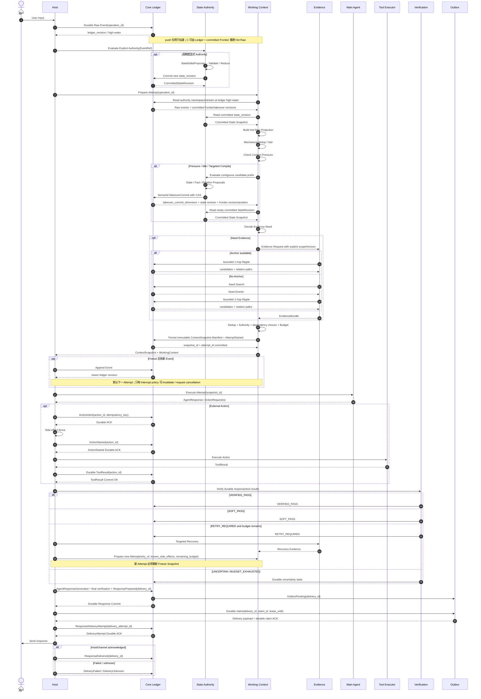

# Long-term Agent / Context Compiler
## Architecture Contract v3.1.1 — 2026-08-24

> 状态：**正式目标协议 / Authority Contract HEAD**
> 用途：统一定义长期 Agent / Context Compiler 的数据语义、Authority、Revision、Replay、Semantic Takeover、Context Snapshot、Operation / Attempt / Action、Verification、Delivery 与 Shadow Promotion 合同。
> 本文是目标协议，不假设当前 repo 已按本文实现。

---

# 0. v3.1.1 收口摘要

v3.1.1 在 v3 基础上正式冻结：

1. 四个一级运行进度轴完全分离：
   - `ledger_revision`
   - `state_revision`
   - `raw_frontier_revision`
   - `takeover_commit_revision`

2. 所有一级 revision 都必须携带：
   - `namespace`
   - `stream_id`

3. 不同 stream 的 revision 数字不得直接比较；跨 namespace 只能通过稳定对象引用、Relation 和 Promotion Event 建立因果关系。

4. `takeover_commit_id` 与 `takeover_commit_revision` 同时存在：
   - `takeover_commit_id`：幂等身份；
   - `takeover_commit_revision`：stream 内单调顺序。

5. Semantic Takeover 与 Semantic Enrichment 正式拆分：
   - Takeover：只能覆盖当前 Frontier 起始的连续安全前缀，并可推进 Frontier；
   - Enrichment：可处理任意非连续历史，但绝不能推进 Frontier。

6. Takeover 使用 CAS：
   - `expected_previous_frontier`
   - `next_frontier`
   - 竞争失败必须重新计算，不能重复接管。

7. Takeover 对必需 proposal 采用 fail-closed：
   - 必需 proposal 任一失败，则本次 Takeover 整笔不推进 Frontier；
   - 可保留的合法子结果只能另建 Enrichment Commit。

8. Snapshot Manifest 是持久、不可变 Artifact；Working Context 正文允许内容寻址缓存/重建。

9. Snapshot 中 Host 信息保持 opaque：
   - Core 保存 Host 提供的结构化描述 / digest；
   - Core 不解释 provider、工具、执行环境语义。

10. `operation_id → attempt_id → action_id` 为正式执行身份层级。

11. 外部副作用只承诺：
   - durable intent
   - at-least-once 风险可见
   - executor-specific idempotency
   - reconciliation
   不承诺通用 global exactly-once。

12. Interrupt 与副作用取消解耦：
   - `CANCELLATION_REQUESTED`
   - `CANCELLED_BEFORE_DISPATCH`
   - `SIDE_EFFECT_STATUS_UNKNOWN`
   - `RECONCILE_REQUIRED`

13. Response Delivery 采用 Outbox 语义：
   - `ResponsePrepared`
   - `ResponseDeliveryAttempt`
   - `ResponseDelivered / DeliveryFailed / DeliveryUnknown`

14. Fact epistemic 语义拆成三个正交轴：
   - `epistemic_origin`
   - `verification_status`
   - `lifecycle_status`
   归档单独使用 `record_status`。

15. Shadow Promotion 不能原地改 namespace：
   - Shadow Object
   - `PromotionProposal`
   - Authority Policy 重验 / 重算
   - 新建 Authority Object
   - `DERIVED_FROM` Shadow Object

16. Architecture Contract、Umbrella Plan、Child Work Order 三层分离：
   - Contract = 统一权威协议；
   - Umbrella = 阶段 / 依赖 / Promotion Gate；
   - Child WO = Codex 实际执行的单结果、独立 QA 单元。

17. `ActionStarted` 必须先 durable commit 并取得 ACK，Host 才能 dispatch Tool；允许保守假阳性，禁止副作用已可能发生而 Ledger 仍只有 ActionIntent。

18. `ResponsePrepared + OutboxPending(delivery_id)` 必须原子提交；Outbox claim 必须 durable、带 lease，并对 expired lease、DeliveryUnknown 与 channel idempotency 提供恢复语义。

19. `raw_frontier_revision` 与 `frontier_position` 正式分离：前者是 Frontier authority record 的版本，后者是已安全接管的最高连续 Ledger boundary；CAS 同时校验二者。

20. Event Ripple 的未来 `Audit Ripple` 用途只保留为非规范研究观察，不构成 v3.1.1 blocker，不扩大 WO-01 scope。

---

# 1. 顶层架构原则

## 1.1 模块不是设计起点

```text
Canonical Data
    ↓
Authority / Owner
    ↓
Revision / Namespace / Stream
    ↓
Mutation Boundary
    ↓
Transaction / Replay Contract
    ↓
Data Flow + Control Flow
    ↓
Invariant
    ↓
Change Coupling
    ↓
Physical Module
```

模块是这些约束自然聚类后的结果。

## 1.2 Modular Monolith

当前仍是：

```text
单 repo
单服务 / 小型 MCP 或 Assistant Core
本地 SQLite / 文件 / 索引优先
```

不做微服务化。

## 1.3 Graph-native ≠ Graph Database

逻辑上：

```text
Event / Fact / State / Experience
             ↕ typed Relation
```

当前可继续由 SQLite 承载。

只有真实数据证明复杂多跳 traversal、path scoring、graph algorithm 或性能成为瓶颈后，才重新评估 Graph DB。

## 1.4 Raw 是事实根

```text
Raw Source / Raw Event
        ↓
Fact / Relation
State
Compaction
Evidence index
Experience（未来）
```

Derived Data 可以重建、supersede、降权；Raw Event 不能被改写。

## 1.5 Propose, don't mutate

模型 / Extractor / Linker 默认只产生：

```text
FactProposal
RelationProposal
StateDeltaProposal
PromotionProposal
StateReevaluationProposal
```

不能直接获得 Authority 写权限。

## 1.6 Frozen Baseline + Shadow Promotion

既有 frozen v0 与 official artifacts 是迁移基线。

新 Runtime：

```text
feature flag / shadow / side-by-side
        ↓
replay / dogfood / correctness / mismatch / regression gate
        ↓
PromotionProposal
        ↓
Authority Policy 重验 / 必要时重算
        ↓
新建 Authority Object
        ↓
DERIVED_FROM shadow object
```

禁止：

```text
shadow namespace
→ 原地改成 authority
```

Shadow 原件永久保留原身份。

## 1.7 Local-first / No Hidden Network

Context / State / Evidence / Verification 不得隐式选择远端 provider。

不得为了 pruning / compaction / classification 自动把完整长期 Raw History 发给远端模型。

---

# 2. Core / Host Responsibility Boundary

> Core / Host 是逻辑责任边界，不要求拆进程。

## 2.1 Core

Core 负责：

```text
Event / Fact / Relation Ledger
State Authority
Revision / namespace / stream
Raw Frontier / Compaction
Semantic Takeover / Enrichment
Context Snapshot Construction
Evidence Routing / Ripple / Retrieval
Replay / consistency
Deterministic / cheap contracts
Response Outbox state
```

Core 不感知调用方是 Codex、Desktop Pet、Chat 或 Work。

## 2.2 Host

Host 负责：

```text
MCP / Chat / App transport
Main LLM invocation
Tool Executor
External side effects
Heavy model verification（若启用）
User delivery
Host execution metadata
```

## 2.3 Host Manifest 对 Core opaque

Snapshot 中可保存：

```text
host_manifest:
  model_identity_digest
  tool_registry_digest
  execution_environment_digest
  host_config_digest
  attachment/content hashes
  opaque_metadata
```

Core 只负责保存 / hash / replay identity，不解释：

- provider 是谁；
- 模型是什么；
- Tool Registry 业务含义；
- 执行环境内部结构。

---

# 3. Namespace / Stream / Revision Model

## 3.1 Revision 的作用域

任何一级运行 revision 都必须绑定：

```text
namespace
stream_id
revision
```

例如：

```text
authority / project-A / state:47
shadow:exp-12 / project-A / state:31
```

不同 stream：

> revision 数字不得直接比较。

跨 stream / namespace 只能通过：

- stable object id；
- typed Relation；
- Promotion Event；

建立因果关系。

## 3.2 四个一级运行进度轴

### Ledger Revision

```text
ledger_revision
```

表示：

> 该 stream 的事实 Ledger 已 durable append 到哪里。

### State Revision

```text
state_revision
```

表示：

> 该 stream 当前 Authority State 的版本。

显式高 Authority 可以只推进 State，不推进 Frontier。

### Raw Frontier Revision

```text
raw_frontier_revision
```

表示：

> Frontier authority record 在该 stream 内的单调版本。

它回答“Frontier 记录被修改了多少个版本”，不回答 Raw 已接管到哪里。

### Frontier Position

```text
frontier_position
```

表示：

> 已完成安全 Semantic Takeover 的最高连续 Ledger boundary。

例如：

```text
raw_frontier_revision = 18
frontier_position = ledger:930
```

`frontier_position` 不是第五个一级 revision 轴，而是 `raw_frontier_revision` 所指向的连续覆盖边界。

### Takeover Commit Revision

```text
takeover_commit_revision
```

表示：

> Semantic Takeover Commit 在该 stream 内的单调顺序。

同时保留：

```text
takeover_commit_id
```

作为幂等身份。

## 3.3 Fact / Relation Revision

Fact / Relation 自己可以保留 object/domain revision。

它们不属于上述四个一级运行进度轴。

---

# 4. Canonical Data

## 4.1 Raw Source / Raw Event

Raw Source：

- 用户输入；
- Tool 原始结果；
- 文件；
- 外部观察。

Raw Event：

- append-only；
- 稳定 `event_id`；
- `namespace + stream_id + ledger_revision`；
- replay 的事实源。

## 4.2 Fact Epistemic Model

Fact 至少分三个正交轴。

### epistemic_origin

```text
user_asserted
tool_observed
host_observed
imported
model_inferred
```

表示：

> 这条 Fact 最初从哪里来。

### verification_status

```text
unverified
corroborated
verified
contested
disconfirmed
```

其中 `contested` **严格限定**为：

> 当前存在未解决的冲突证据，因此尚不能形成 verified / disconfirmed 判断。

如果 Fact 已 objectively verified，但有人提出异议：

- 不把 verification_status 改成 contested；
- 使用 `CONTRADICTS` Relation / dispute evidence 表达。

### lifecycle_status

```text
active
superseded
retracted
```

表示事实表达的当前生命周期，不等价于验证强度。

### record_status

```text
live
archived
```

归档是可见性 / 保留状态，不是事实生命周期。

一个 Fact 可以同时：

```text
lifecycle_status = superseded
record_status = archived
```

归档不得抹掉 supersede / retract 的历史原因和 Relation。

### References

```text
provenance_refs: [...]
verification_refs: [...]
```

## 4.3 FactProposal / Durable Fact

Extractor / Compactor 可以生成 FactProposal。

Durable Fact 必须经 Fact Policy / Registry 校验。

## 4.4 RelationProposal / Durable Relation

Relation 是一等数据。

至少：

```text
relation_id
namespace
stream_id

source_type
source_id
relation_type
target_type
target_id

origin
provenance_ref
confidence?
status
relation_revision
created_at
metadata?
```

RelationProposal 不能直接成为 Durable Relation。

## 4.5 StateDeltaProposal / CommittedStateRevision

Pending State 无 Authority。

只有：

```text
CommittedStateRevision
```

可以改变正式：

- Working Context；
- Retrieval policy；
- Agent decision；
- Tool side effect。

## 4.6 Hot Raw Tail / Raw Frontier

Hot Raw Tail：

> 尚未完成安全 Semantic Takeover、仍需 Raw 形式参与 Working Context 的 Event。

特点：

- 不使用固定 recent-N；
- 不绑定单一 chat session；
- 可跨 session；
- 可由 Ledger + committed Frontier 重建。

## 4.7 Compaction Artifact

至少绑定：

```text
artifact_id
artifact_hash
namespace
stream_id
covered_raw_range
generator_version
policy_hash
provenance_refs
```

## 4.8 EvidenceCandidate / EvidenceBundle

EvidenceCandidate 至少：

```text
event_ref / fact_ref
anchor_ref?
relation_path?
search_scope
search_horizon
retrieval_method
score / rank
provenance_ref
```

## 4.9 ContextSnapshot Manifest

Snapshot Manifest：

> 持久、不可变、可审计的 execution manifest。

最低：

```text
snapshot_id
namespace
stream_id

operation_id
attempt_id

ledger_as_of_revision
state_revision
raw_frontier_revision
frontier_position
takeover_commit_revision

hot_raw_event_refs
hot_raw_hash

evidence_bundle_id
evidence_event_refs
evidence_relation_paths

policy_hash
config_hash
projection_version
assembler_version_hash

current_input_event_id
current_input_hash

host_manifest_digest
external_content_hashes

working_context_hash
created_at
```

Working Context 正文：

- 可以持久存储；
- 也允许基于内容寻址缓存 / 重建；

但 Snapshot Manifest 必须持久且不可变。

## 4.10 Operation / Attempt / Action

```text
operation_id
  └─ attempt_id
       ├─ action_id_1
       ├─ action_id_2
       └─ action_id_3
```

Operation：

> 一次完整用户任务。

Attempt：

> 一次 Freeze Snapshot → Agent → Verification。

Action：

> 一次独立外部副作用请求。

一个 Attempt 可以有多个 Action，允许并行。

## 4.11 Verification Result

```text
VERIFIED_PASS
SOFT_PASS
RETRY_REQUIRED
UNCERTAIN
BUDGET_EXHAUSTED
```

## 4.12 Response / Delivery

```text
AgentResponseGenerated
ResponsePrepared
ResponseDeliveryAttempt
ResponseDelivered
DeliveryFailed
DeliveryUnknown
```

ResponsePrepared ≠ Delivered。

---

# 5. State Evolution Policy

## 5.1 Immediate Explicit Authority

高精度显式规则：

```text
必须
禁止
撤销
最终决定
之前规则作废
```

流程：

```text
New Event
→ Explicit Authority Detector
→ StateDeltaProposal
→ Validate / Reduce
→ CommittedStateRevision
```

显式 Authority 不移动 Raw Frontier。

## 5.2 Lazy Historical Compilation

普通 Goal / Decision / OpenQuestion 可暂存在 Hot Raw。

触发：

- Context Pressure；
- Idle / Time-triggered check。

## 5.3 Targeted On-demand Compile

如果某个正式操作在 Pressure 前必须依赖结构化 State：

```text
Evaluate selected EventRef / segment
→ Proposal
→ Commit
→ 才可驱动正式 Attempt
```

## 5.4 Detector 实现不冻结

规则、小模型、向量可以组合。

当前只冻结：

> Detector 产生 Proposal，不拥有 State Authority。

---

# 6. Snapshot Contract

## 6.1 Ledger 是 Hot Raw 恢复事实源

push notification 仅优化。

启动 / crash recovery：

```text
Read latest committed raw_frontier_revision
+
Read Ledger events after covered frontier
→ Rebuild Hot Raw Tail
```

因此：

```text
Ingest Commit OK
→ crash
→ Context 没收到 push
```

不会丢 Raw。

## 6.2 Snapshot Freeze

Context Assembly 先选择：

```text
ledger_as_of_revision = N
```

本 Attempt 默认只消费：

```text
event.revision <= N
```

最终冻结持久 Snapshot Manifest。

## 6.3 AttemptStarted 与 Snapshot

硬约束：

> Attempt 不得引用不存在 / 未冻结的 Snapshot。

推荐：

### 同一 DB

```text
SnapshotManifest + AttemptStarted
→ 单事务
```

### Content-addressed Snapshot Artifact

允许：

```text
write immutable Snapshot
→ atomic AttemptStarted(ref snapshot_id)
```

孤儿 Snapshot 可保留 / GC，不影响正确性。

## 6.4 外部文件 / 附件

Snapshot 不能只记录路径。

必须记录：

```text
stable ref
+
content hash
```

避免同路径内容变化破坏 replay。

## 6.5 并发新 Event

默认：

```text
event_revision <= snapshot.ledger_as_of
→ 当前 Attempt

event_revision > snapshot.ledger_as_of
→ 下一 Attempt
```

## 6.6 Interrupt-class Event

Authority ≠ Interrupt。

只有：

```text
interrupt semantic
+
scope intersects current operation
+
interrupt policy permits
```

才使当前 Attempt invalid / cancellation requested。

---

# 7. Semantic Takeover / Enrichment Contract

## 7.1 SemanticTakeoverCommit

语义：

> 当前 Frontier 开始的一段**连续安全前缀**已经被完整结构化接管，可以推进 Frontier。

硬约束：

```text
covered_raw_range
必须从 current frontier_position 的直接后继开始连续
```

不允许空洞 / 非连续 range 推进 Frontier。`frontier_position` 表示覆盖位置；`raw_frontier_revision` 表示该位置记录的 authority version。

## 7.2 CAS

Takeover 必须携带：

```text
expected_frontier_revision
expected_frontier_position
new_frontier_revision
new_frontier_position
```

提交时必须同时校验：

```text
CAS(
  expected_frontier_revision,
  expected_frontier_position
)
```

成功后原子产生新的 revision 与 position。任一预期值不匹配时：

> 不提交、不重复接管，重新读取并计算。

## 7.3 Takeover Commit Identity / Ordering

同时保留：

```text
takeover_commit_id
takeover_commit_revision
```

前者：

> 幂等身份。

后者：

> stream 内单调顺序。

## 7.4 Takeover 内容

至少：

```text
takeover_commit_id
namespace
stream_id
takeover_commit_revision

ledger_base_revision
covered_raw_range

expected_frontier_revision
expected_frontier_position
new_frontier_revision
new_frontier_position

previous_state_revision
new_state_revision

fact_revision
relation_revision

compaction_artifact_id/hash

policy_hash
provenance_refs
```

## 7.5 严格 fail-closed

如果 covered range 中存在必需 proposal 验证失败：

> 整个 SemanticTakeoverCommit 回滚，不推进 Frontier。

禁止：

```text
只提交合法一半
但把整段标记为已接管
```

如果合法子结果值得保留：

> 另建 `SemanticEnrichmentCommit`。

## 7.6 SemanticEnrichmentCommit

用于：

- 非连续旧 Event；
- 后台补 Fact / Relation；
- Ripple 后关系增强；
- 历史 metadata enrichment。

特点：

```text
可以非连续
可以处理很老历史
绝不能推进 Raw Frontier
```

## 7.7 显式 Authority 提交

Immediate Authority 虽然不移动 Frontier，但同样遵循：

```text
Proposal
→ Validation
→ Revision Commit
→ Idempotency
```

不能成为事务合同之外的后门。

---

# 8. Working Context / Mechanical Projection

## 8.1 Always-on Mechanical Projection

每次 Active Raw append / update 都允许：

- exact duplicate；
- Tool Result folding；
- repeated log folding；
- boilerplate removal；
- deterministic structural projection。

只能改变：

```text
ActiveContextProjection
```

不得删除 / 修改 Ledger Raw Event。

Projection 必须保留 source Event refs。

## 8.2 Pressure-triggered Semantic Compaction

Pressure 依据：

- token；
- active working set；
- host context capacity；

不使用固定 turn count。

原则：

> 长度决定 WHEN；闭合度与风险决定 WHAT。

## 8.3 Idle Compilation

时间只触发：

> 检查是否存在可安全整理历史。

时间不自动判定 closed。

---

# 9. Evidence Retrieval / Event Ripple

Evidence Retrieval：

```text
Search Space Selection
Anchor / Seed
Event Ripple
Query Formation
Retriever
Ranking
Recovery
```

Search Scope / Horizon 是一等决策。

Retriever 只能在已经允许进入 Candidate Scope 的历史中排序。

## 9.1 Normal

有 Anchor：

```text
Anchor → bounded 1-hop Ripple
```

无 Anchor：

```text
Seed Search
→ Seed
→ bounded 1-hop Ripple
```

要求：

- relation allow-list；
- bounded fan-out；
- authority/origin aware；
- strict candidate budget；
- relation path 可审计。

## 9.2 Recovery

只有 Normal miss / Red Flag / Verification failure 时升级：

- expand scope；
- change anchor；
- reframe；
- larger Top-K；
- bounded deeper Ripple；
- global fallback。

DSH_HOME 型回归必须保留。

## 9.3 Context 回流

```text
Hot Raw
+ Committed State
+ Evidence
→ cross-source dedup
→ Authority precedence
→ dependency closure
→ budget
→ ContextSnapshot
```

## 9.4 Audit Ripple（非规范研究观察）

一次跨 Agent 转述对抗观察显示：显式语义矛盾较容易被一致性检查发现，但静默删除已有约束更难仅靠模型当前上下文可靠识别。

因此未来可以分别研究：

```text
Revision / Structural Diff
→ 对版本删除、变更做确定性检查

Event Ripple + typed Relation / dependency
→ 对 supports / contradicts / supersedes / missing dependency / unexpected omission
   做概率性的 Continuity Audit
```

该方向暂称 `Audit Ripple`。它不是当前冻结算法，不是 v3.1.1 blocker，不扩大 WO-01 scope，也不授权新增 Retriever、Relation 或 Context 行为。

---

# 10. Operation / Attempt / Action Lifecycle

## 10.1 Operation

```text
operation_id
```

一次完整用户任务，Retry 期间不变。

## 10.2 Attempt

每次：

```text
Freeze Snapshot
→ Agent
→ Tool optional
→ Verification
```

产生新：

```text
attempt_id
```

Retry：

```text
new attempt_id
retry_of = previous_attempt_id
same operation_id
```

## 10.3 Action

每个 Tool / 外部副作用：

```text
action_id
```

一个 Attempt 可多个 Action。

### 生命周期

```text
ActionRequest
→ ActionIntent
→ ActionStarted
→ ToolResult
→ Outcome
```

## 10.4 ActionStarted 的严格语义

定义为：

> 从这个状态开始，外部副作用已经**可能发生**，系统不能再安全假设“什么都没发生”。

它不是某个具体执行器内部 API 名称。

正式 durable 顺序必须是：

```text
ActionIntent
→ Durable ACK

ActionStarted
→ Durable ACK
→ Tool dispatch
```

允许 `ActionStarted` 已 durable、但 Tool 实际尚未收到的保守假阳性。绝不允许 Tool 已可能产生副作用、但 Ledger 仍只有 `ActionIntent` 的危险假阴性。`ActionStarted` commit 失败时不得 dispatch Tool。

## 10.5 At-least-once / Idempotency

系统不承诺通用 global exactly-once。

合同是：

```text
durable ActionIntent
+
stable action_id / idempotency_key
+
executor-specific idempotency
+
reconciliation
```

## 10.6 多 Action 部分成功

每个 Action 独立 lifecycle。

同一 Attempt 可以：

```text
Action A = SUCCEEDED
Action B = FAILED
Action C = RECONCILE_REQUIRED
```

Retry 前必须携带已发生副作用列表。

---

# 11. Interrupt / Cancellation Contract

## 11.1 尚未 dispatch

如果 Action 尚未越过 ActionStarted：

```text
CANCELLATION_REQUESTED
→ CANCELLED_BEFORE_DISPATCH
```

## 11.2 已进入 ActionStarted

Interrupt：

> 只能阻止后续动作，不能宣称已经撤销外部效果。

可能进入：

```text
SIDE_EFFECT_STATUS_UNKNOWN
RECONCILE_REQUIRED
```

需要 Host / Executor reconciliation。

---

# 12. Verification / Recovery

优先 Existing Oracle：

- tests；
- tool status；
- schema；
- contract；
- acceptance criteria；
- provenance。

状态：

```text
VERIFIED_PASS
SOFT_PASS
RETRY_REQUIRED
UNCERTAIN
BUDGET_EXHAUSTED
```

Heavy Verifier：

- risk-gated；
- explicit provider；
- 默认关闭或 shadow；
- 不得每请求固定调用。

Recovery 必须 bounded：

```text
max_attempts
max_scope_expansions
max_ripple_depth
max_external_action_retries
```

具体默认数字不在 v3.1.1 冻结。

---

# 13. Response / Outbox Delivery Contract

## 13.1 ResponsePrepared

Core 在允许 Host 交付前必须以同一事务或等价原子提交 durable：

```text
Transaction:
  ResponsePrepared
  + OutboxPending(delivery_id)
→ durable commit
```

如果该事务提交失败：

> 不向用户交付；不得存在只有 ResponsePrepared 或只有 OutboxPending 的半提交。

## 13.2 Outbox

Outbox claim 必须 durable，至少记录：

```text
claim_id
delivery_attempt_id
lease_owner
lease_until
status
```

Host：

```text
Durable claim OutboxPending
→ ResponseDeliveryAttempt durable
→ channel
```

Host 在 send 前 crash：过期 lease 可以 reclaim。Host 已调用 send 但 ACK 不可确认时：

```text
DeliveryUnknown
```

不得直接标成 `DeliveryFailed` 后 blind resend；必须依赖稳定 delivery identity、渠道幂等能力或 reconciliation。

最终记录：

```text
ResponseDelivered
or
DeliveryFailed
or
DeliveryUnknown
```

## 13.3 Delivered 的含义

`ResponseDelivered` 只有在 Host / Channel 获得可用确认时才能记录。

仅调用：

```text
send()
```

不等于 Delivered。

## 13.4 Delivery Idempotency

使用稳定：

```text
delivery_id
```

如果渠道支持幂等：

> 使用渠道幂等能力。

如果不支持：

> 不宣称绝对 exactly-once；允许极低概率重复，并保留 Delivery Attempt 审计。

---

# 14. Agent Response / Outcome / Feedback

纯回答也记录：

```text
AgentResponseGenerated
VerificationResult
ResponsePrepared
```

但不能自动产生：

```text
UserAccepted
RecommendationWorked
SuccessfulOutcome
```

Event–Action–Outcome–Feedback 必须客观拆分。

---

# 15. Shadow Namespace / Promotion

## 15.1 Shadow 隔离

Shadow 数据必须进入独立：

```text
namespace = shadow:<experiment_id>
```

包括：

- Shadow State；
- Shadow Relation；
- Shadow Snapshot；
- Shadow Context result；
- Shadow Experience（未来）。

默认不得进入 authority Retrieval / Current State。

## 15.2 Promotion

```text
Shadow Object
→ PromotionProposal
→ Authority Policy 重验 / 必要时重算
→ New Authority Object
→ DERIVED_FROM Shadow Object
```

禁止原地修改 namespace。

---

# 16. Background Maintenance

允许：

- SemanticEnrichmentCommit；
- RelationProposal enrichment；
- index；
- embedding；
- graph quality；
- Idle Compilation；
- Future Experience Formation。

禁止：

- 改 Raw；
- 改 Gold provenance；
- 改历史 Snapshot；
- 直接改 Current State；
- 把 shadow object 原地晋升 authority。

发现可能推翻 State：

```text
StateReevaluationProposal
```

---

# 17. PACE 的位置

PACE：

```text
Working Context
      ↕
PACE-like paging / page-in / page-out
      ↕
Historical Evidence
```

不是 Runtime 总编排器，也不是唯一 paging 算法。

---

# 18. Target Runtime Sequence v3.1.1



---

# 19. 关键不变量

1. Raw Event append-only。
2. Ledger 是 Hot Raw / replay 的唯一事实源。
3. Mechanical cleanup 只修改 projection。
4. Fixed recent-N / turn-count 不是 Raw Frontier 边界。
5. Hot Raw 可跨 session。
6. Pending State 无 Authority。
7. 会影响正式执行的 State 必须 committed。
8. 四个一级 revision 必须分轴。
9. 一级 revision 必须携带 namespace + stream_id。
10. 不同 stream revision 不直接比较。
11. Fact epistemic_origin 与 verification_status 分离。
12. contested 只表示 unresolved conflicting evidence。
13. superseded / retracted 属于 lifecycle，不属于 verification。
14. archived 属于 record_status。
15. Relation 是 typed、versioned、provenance-backed 一等数据。
16. SemanticTakeover 只覆盖 current Frontier 起始的连续安全前缀。
17. SemanticTakeover 使用 CAS。
18. Takeover 必需 proposal 任一失败则 fail-closed。
19. 非连续历史只能 Enrichment，不能推进 Frontier。
20. takeover_commit_id 与 takeover_commit_revision 同时存在。
21. Compaction Artifact 必须有内容 hash / covered range / generator / policy identity。
22. Snapshot Manifest 持久、不可变。
23. Snapshot 必须记录所有执行相关 revision / input / evidence / host opaque digest。
24. 外部文件必须使用内容 hash，而不是只保存路径。
25. Freeze 后新 Event 默认属于下一 Attempt。
26. Authority ≠ Interrupt。
27. operation_id / attempt_id / action_id 分层。
28. ActionStarted 之后副作用状态不能假定为空。
29. 不承诺 global exactly-once。
30. ToolResult durable 后才能 Verification。
31. ActionStarted 无 ToolResult 时优先 reconciliation。
32. Recovery / Verification 必须有界。
33. ResponsePrepared ≠ Delivered。
34. Delivery 使用 outbox + stable delivery_id。
35. Shadow object 不得原地 promotion。
36. Background enrichment 不得静默改变 Current State。
37. Host Manifest 对 Core opaque。
38. Core / Host 是责任边界，不要求微服务。
39. 新 Runtime 未通过 shadow / replay / dogfood / regression gate 前不得 Promotion。
40. raw_frontier_revision 与 frontier_position 不得混用；CAS 必须同时校验预期 revision 与 position。
41. ActionStarted 必须 durable ACK 后才允许 Tool dispatch。
42. ResponsePrepared 与 OutboxPending 必须原子提交；Outbox claim/attempt 必须 durable 且可恢复。

---

# 20. 当前不冻结的实现细节

- Authority Detector 采用规则 / 小模型 / 向量的最终组合；
- Context Pressure 阈值；
- Idle 时间；
- Interrupt Detector / policy；
- Retriever 最终算法；
- Recovery 最大 hop / max attempts 的具体默认值；
- Heavy Verification provider / classifier；
- Graph DB；
- Experience Formation；
- Context scoring / budget 公式；
- 数据 retention / 脱敏 / 隐私治理策略；
- Host 是否提供可靠 Delivery acknowledgement。

这些允许建立 Port / Policy / Fixture，但不得在本轮实施中自行写死为长期架构。
